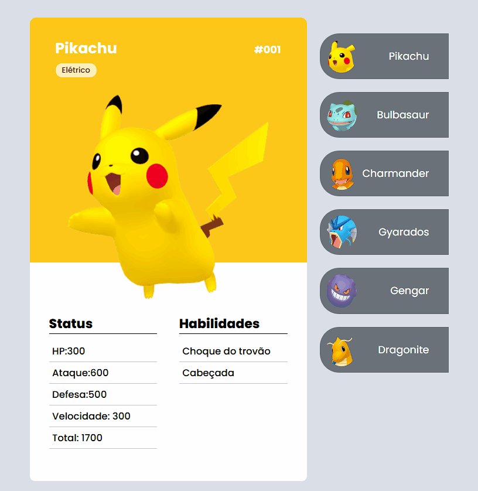

<h1 align="center">Projeto Poké dex!</h1>

      

## Sobre
- Este projeto foi de grande importância para mim. Desde a minha infância, sou apaixonado por Pokémon, e, por isso, decidi criar este projeto inspirado no projeto do curso DevEmDobro. No entanto, ao contrário do projeto original, este foi desenvolvido inteiramente com HTML e CSS, com o objetivo de testar e aprimorar minhas habilidades nas Linguagens de marcação e estilo.
- Apesar das dúvidas e dificuldades, consegui alcançar um resultado final organizado e bem estruturado.

## Tecnologias Utilizadas 
- HTML 
- CSS

## Responsividade
- Apenas para Desktop
## Dificuldades deste projeto 
- Aprendi muito durante o desenvolvimento deste site, especialmente sobre como utilizar mecânicas simples, como HTML e CSS, para criar um projeto bem-executado e divertido de desenvolver.

O link para o repositório do GitHub, de onde obtive a ideia para este projeto, pode ser encontrado <a  target="_blank" href="https://github.com/devemdobro/projeto-pokedex-mapadev-week"> aqui.</a>.
